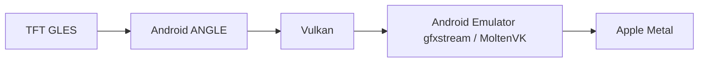
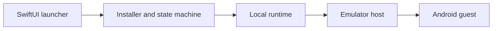

# Mactician

**A native, open-source TFT launcher for Apple Silicon.**

Mactician prepares and manages everything needed to play TFT on a modern
Mac—without Android Studio, Terminal commands, or manual configuration.

Created by [Sergei Naumov](https://sergeinaumov.dev/writing), a backend and
security platform engineer. Read my [technical writing](https://sergeinaumov.dev/writing/how-i-built-mactician) about this project
or connect with me on [LinkedIn](https://www.linkedin.com/in/sergei-naumov-dev/).

> **Fork notice.** This repository is a community fork of
> [tweet9ra/mactician](https://github.com/tweet9ra/mactician). Mactician was
> created by Sergei Naumov, and the paragraph above is his own text. See
> [About this fork](#about-this-fork) for the credits and exactly what this fork
> changes.

[Download Mactician](https://github.com/changnm/mactician/releases/tag/v1.3.1) ·
[Documentation](#documentation) ·
[Technical case study](https://sergeinaumov.dev/writing/how-i-built-mactician)

Built for two tacticians. Shared with everyone.


## About this fork

**Mactician is the work of [Sergei Naumov](https://sergeinaumov.dev/writing).**
The launcher, the Android runtime integration, the graphics and performance
research, and nearly all of the code and documentation in this repository are
his. This fork is maintained independently by
[Trang Nguyen](https://github.com/changnm) and is not an official release of the
original project. Please credit and support the original author:

- [Original repository](https://github.com/tweet9ra/mactician) and its
  [releases](https://github.com/tweet9ra/mactician/releases)
- [Technical case study](https://sergeinaumov.dev/writing/how-i-built-mactician)
- [Donations](https://app.lava.top/mactician?tabId=donate) and the
  [feedback board](https://sergeinaumov.dev/mactician/feedback)

The original MIT license and copyright notice are kept unchanged in
[LICENSE](LICENSE) and [NOTICE.md](NOTICE.md).

### Based on

Upstream `master` at commit `8a94fba`. That includes upstream work that is not
yet in an upstream release (the latest is
[v1.3.0](https://github.com/tweet9ra/mactician/releases/tag/v1.3.0)): the Taiwan
edition and the Global TFT 18.3 pin.

### What this fork changes

Everything below is on top of that commit; the rest is upstream's. Unmodified
areas include the emulator runtime, graphics and performance code, telemetry,
and the launcher's identity.

- **Game update checks.** The update button names the target patch
  ("Update to 18.4"), the launcher rechecks the signed game feed every 30 minutes
  and when the app is reactivated, and Settings has a "Check for game update"
  button that reports up to date, available, or the network error. English and
  Russian strings included.
- **Newest game on every build.** Vietnam (VNG) TFT 18.3-5530794 now ships inside
  the launcher, like Global, through a new `editionGames` section in the release
  manifest. A newer bundled release upgrades an older install on launch, and a
  hosted feed older than the installed game counts as up to date instead of
  failing the check. The build script verifies the bundled APKs against the
  manifest hashes.
- **Automated feed publishing.** A scheduled workflow and
  `scripts/auto-publish-game-update.command` that fetch the newest TFT build per
  edition, verify it, and publish the signed feed when it is newer. This needs
  your own feed key and server; it does not publish to the original author's.
- **Local development feed.** A development-only game feed
  (`-D MACTICIAN_DEV_FEED`) for testing updates against a local folder. It is not
  compiled into normal builds.
- **Build and release documentation.** A rewritten build guide, a guide to
  preparing and verifying the APK inputs, and a guide to publishing a build on
  GitHub Releases from a fork ([Building](docs/building.md),
  [Releasing](docs/releasing.md)), plus new tests for the changes above.
- **Version 1.3.1 (build 56).** Ad-hoc signed and not notarized; see
  [Download and installation](#download-and-installation).

### What still uses the original author's services

This fork keeps the original identity: a build checks the original Sparkle
appcast and signed game feed, uses the original telemetry and announcement API,
and links to the original feedback, donation, and privacy pages (all on
`sergeinaumov.dev`). The privacy behavior in
[Telemetry and privacy](docs/telemetry.md) therefore applies unchanged. A fork
build can be offered the original author's builds as updates; see
[Releasing](docs/releasing.md#publish-on-github-releases-forks-and-ad-hoc-builds).

## Project status

- Version: **1.3.1** (build 56)
- Host architecture: **Apple Silicon (`arm64`)**
- Minimum deployment target: **macOS 12.0**, enforced by the build target and
  runtime preflight
- Status: **experimental, best effort**; there is no support or compatibility
  SLA
- Compatibility is pinned to TFT `18.3-5530794`, Android Emulator 37.1.11,
  and Android 36. A game or emulator update can require a new Mactician release.

## Preview


Mactician keeps launcher controls and the running TFT window side by side.
The native SwiftUI interface is localized in English and Russian; game language
is configured independently.

## Features

- Choose Global, Vietnam (VNG), or Taiwan in Settings. Global and Vietnam ship
  inside the launcher and install without a game download; Taiwan downloads on
  first selection. Each edition keeps its own game data and sign-in.

- Installs and verifies pinned Android Platform Tools, Emulator, and system
  image archives.
- Verifies every downloaded component and bundled game split with SHA-256.
- Creates, provisions, starts, stops, repairs, and resets a dedicated AVD.
- Offers resolution, UI scale, Android RAM, vCPU, game-language, and three
  graphics-detail controls, including a reversible Maximum FPS profile.
- Preserves the local Android runtime, Riot sign-in, game data, and launcher
  preferences across full application updates.
- Repairs incomplete installs and a known zero-byte streaming-install cache
  without clearing unrelated app data.
- Provides game hotkeys for shop, reroll, XP, item/trait and player/damage tabs,
  plus the macOS window-fill shortcut.
- Links to the feedback board and [donations](https://app.lava.top/mactician?tabId=donate).
- Uses a Sparkle appcast with Ed25519 archive verification for updates; public
  releases are Developer ID signed and Apple-notarized.
- Sends minimized activation events, a versioned one-time fresh census, and an
  unlinkable duration-only summary after every completed session; separately
  consented extended diagnostics remain optional. It can also display validated operator messages. See
  [Telemetry and privacy](docs/telemetry.md).
- Includes a disabled-by-default Native iPad Runtime proof of concept for
  validating and launching a separately prepared `.app` without acquiring,
  modifying, or signing it. Android remains the default and supported path.

## Requirements

### To run a release

- An Apple Silicon Mac with macOS 12.0 or later.
- At least 8 GB of system memory; 8 GB Macs use a reduced 4 GB Android guest.
- At least 25 GiB of free disk space for downloads, extraction, the AVD, TFT
  assets, and update headroom.
- Internet access to Google's Android repository and TFT services.
- Hypervisor Framework support, available on supported Apple Silicon Macs.
- Acceptance of the linked Android SDK terms during installation.
- Accessibility permission only if the built-in game hotkeys are used. The
  emulator itself does not need this permission.

### To build from source

Xcode Command Line Tools, zsh, `jq`, `rg`, Android NDK r27d, and the exact
unmodified TFT APK splits matching the release manifest (four for Global and
four for Vietnam) are required. Node.js is needed only for the optional
Keychain-backed login helper. Developer ID credentials, a
notarytool Keychain profile, and a Sparkle Ed25519 key are release-only
requirements.

## Download and installation

Download the DMG from this fork's
[release page](https://github.com/changnm/mactician/releases/tag/v1.3.1).
Verify the version, build number,
and the SHA-256 published with that release before opening it.

1. Open the DMG and drag **Mactician** to **Applications**.
2. Open it. Version 1.3.1 is signed ad hoc and is not notarized, so Gatekeeper
   blocks the first launch: open **System Settings → Privacy & Security** and
   choose **Open Anyway**.
3. Review and accept the Android SDK terms, then choose **Install**. About
   2.3 GB is downloaded before extraction and AVD provisioning.
4. Enter Riot credentials manually inside the official TFT client.

Mactician-managed data stays in
`$HOME/Library/Application Support/Mactician`.

**Repair Installation** re-verifies components, refreshes Mactician-owned
runtime scripts, and reprovisions missing pieces while preserving the AVD and
Riot/game state. **Reset** deletes the complete launcher-managed data directory,
including the AVD, sign-in state, and game data, after confirmation.

## Build from source

Keep the pinned APK files outside Git, in `private/` (ignored by Git): four
Global splits in `private/tft-apks` and four Vietnam (VNG) splits in
`private/tft-apks-vietnam`. Their names and hashes are recorded in
[`launcher/Resources/release-manifest.json`](launcher/Resources/release-manifest.json),
and the build refuses to run if any hash differs. See
[Prepare the APK inputs](docs/building.md#prepare-the-apk-inputs) for getting and
verifying them.

### Unit tests and typecheck

```sh
./scripts/verify-repository.command
./scripts/test-mactician.command
```

The test script compiles unit tests for the current host architecture, checks C
syntax, validates release safeguards, runs the tests, and typechecks the full
Apple Silicon production source set.

### Local ad-hoc build

This is the recommended way to build the app you will actually run. One-time
setup: Xcode Command Line Tools (`xcode-select --install`), `jq` and `ripgrep`
(`brew install jq ripgrep`), and Android NDK r27d, which the build uses for the
bundled Vulkan cache:

```sh
"$ANDROID_HOME/cmdline-tools/latest/bin/sdkmanager" --install "ndk;27.3.13750724"
```

Then validate and build from the repository root:

```sh
export TFT_ANDROID_NDK="$ANDROID_HOME/ndk/27.3.13750724"
export TFT_GAME_APK_DIR="$PWD/private/tft-apks"   # Global; Vietnam defaults to private/tft-apks-vietnam
./scripts/test-mactician.command
./scripts/build-mactician.command
```

This produces `dist/Mactician.app` and `dist/Mactician-1.3.0.dmg`, signed ad hoc.
Global and Vietnam (VNG) APKs are bundled, so the build installs the newest game
listed in the manifest without the hosted feed. Notes:

- Quit Mactician before building into `dist/`, or build elsewhere with
  `MACTICIAN_DIST_DIR=/path/to/output` while the app is running.
- Do not set `MACTICIAN_EXTRA_SWIFT_FLAGS` for a build you keep. `-D MACTICIAN_DEV_FEED`
  is a development switch that redirects game updates to a local folder; without
  it the app uses the signed hosted feed and the bundled releases.
- A build is not notarized. On another Mac, open it through **System Settings →
  Privacy & Security → Open Anyway**.
- To ship a newer game, update the manifest and the private APKs together, as
  described in [Building](docs/building.md#prepare-the-apk-inputs).

### Provisioning integration test

After a local build:

```sh
./scripts/integration-test-mactician.command
```

This test downloads the large pinned Android archives and provisions temporary
data, so it is not run on every pull request.

### Signed and notarized release

```sh
PROJECT_DIR="$PWD"
: "${MACTICIAN_CODESIGN_IDENTITY:?Set MACTICIAN_CODESIGN_IDENTITY in the environment}"
: "${MACTICIAN_NOTARY_PROFILE:?Set MACTICIAN_NOTARY_PROFILE in the environment}"
TFT_GAME_APK_DIR="$PROJECT_DIR/private/tft-apks" \
  ./scripts/build-mactician.command
```

Only environment-variable names belong in documentation or automation; never
commit identity secrets, passwords, private update keys, or notarization
credentials. See [Building](docs/building.md) and
[Releasing](docs/releasing.md) for the verified workflow.

Public releases use Developer ID signing, hardened runtime, Apple notarization,
and stapled tickets; local builds remain ad hoc by default.

### Publish a build

To publish a DMG on GitHub Releases like the upstream
[v1.3.0 release](https://github.com/tweet9ra/mactician/releases/tag/v1.3.0) (one
tagged release, one DMG, and its SHA-256 in the notes), follow
[Publish on GitHub Releases](docs/releasing.md#publish-on-github-releases-forks-and-ad-hoc-builds).
Read its notes on versioning, signing, and update behavior first.

## How it works

The game keeps its GLES interface while ANGLE and the emulator translate it to
Apple's graphics stack:



The application owns orchestration and local state; Google's emulator owns the
host/guest boundary:



## Performance research

Only reproducible or explicitly qualified results are treated as conclusions:

- In an exact stage-1-1 battle A/B, ASG measured **40.1 FPS / 34.85 ms p95**
  versus **29.6 FPS / 49.75 ms p95** on the old pipe transport.
- The selected GPU-scene/RHI/MoltenVK stack measured **36.0–36.8 FPS** in the
  later stage-1-5 scene.
- In a controlled stage-1-5 comparison, increasing source pixels from 1600×900
  to 2560×1440 by **2.56×** measured **30.5 versus 31.3 FPS**, showing no
  material loss in that CPU/RHI-bound scene. This does not generalize to every
  scene.
- MoltenVK-128 produced one promising **40.20 / 34.50 / 32.40 FPS** run at
  stages 1-2/1-5/1-8, but cold confirmation fell to
  **39.5 / 31.6 / 23.3 FPS**. It failed the reproducibility threshold and remains
  experimental.

See [Benchmarks](docs/benchmarks.md),
[Reproducibility](docs/reproducibility.md), and the
[Research log](docs/research-log.md) for methodology, rejected experiments, and
limitations. The focused
[native GLES and graphics-transport experiment](docs/native-gles-transport-experiment.md)
documents the shortened-path prototype, its ES 3.2 blockers, and the measured
current-path alternatives.

## Privacy and security

Runtime data, the AVD, downloads, and launcher logs remain local to the Mac.
After the first successfully completed game session, the launcher sends one
basic event containing a fresh event UUID, launcher version/build, calendar day,
and a rounded duration range. It contains no installation/device identifier,
exact duration or time, settings, language, or Mac characteristics. The metric
is reported as **Approximate activated installations**, not as users or people.

The launcher version that starts the fresh census sends one separate
`activation_snapshot` for snapshot version 1 per retained preferences domain.
It waits while the diagnostics choice is unknown, then contains only a fresh
event UUID, snapshot and consent versions, the explicit granted/denied state,
and launcher version/build. It is sent regardless of that choice and carries no
game-session diagnostics. The server keeps this new cumulative series separate
from the earlier, known-undercounted first-session metric.

After the updated telemetry notice is acknowledged, opening Mactician creates
at most one `daily_active` event per retained preferences domain and UTC day.
It contains only a fresh event UUID for that day, the UTC calendar day, and
launcher version/build. The server immediately aggregates it by that calendar
day without retaining the raw payload or source IP. The dashboard labels the
result **Approximate DAU** because separate macOS accounts or cleared
preferences can count again, while unavailable delivery can undercount.

Every completed session sends an independent anonymous summary containing only
a fresh event UUID, duration, and launcher version/build. It contains no date,
exact start/end time, stable identifier, device properties, or settings. The
server immediately aggregates session count and play time by received UTC day,
does not retain the raw payload or its source IP, and cannot link separate
sessions into an installation history.

Every Android launch sends performance checkpoints for all users, independently
of Extended Diagnostics. These include Mac configuration, launcher settings,
game/runtime versions, launch outcomes, sampled frame times, coarse scene
labels, emulator memory and Mac thermal state. Screenshots are classified
locally in memory and are never saved or uploaded. Each attempt has a fresh
random UUID, without a stable installation or user ID, and its latest checkpoint
is retained for 30 days without an attached source IP.

Optional Extended Diagnostics adds separate detailed completed-session rows,
retained for 365 days. Turning that setting off stops those optional rows and
clears their retry queue; performance metrics, activity and session summaries
continue. No event contains a Mac name, serial number, MAC address, Apple/Riot
identity, logs, screenshots or AVD contents. See
[Telemetry and privacy](docs/telemetry.md) for fields and retention.

The same HTTPS API can return a title, text, and optional PNG/JPEG for a popup
when the launcher starts or a game closes. Responses, redirects, image origin,
encoded size, MIME type, dimensions, and pixel count are checked before remote
content is shown.

Accessibility permission is used only for launcher hotkeys. A loopback-only
WebView DevTools connection performs a narrowly scoped login-field repaint
repair without reading or changing form values. Full raw game logs can contain
authentication-like data, so diagnostics must be filtered and sanitized before
sharing. Report vulnerabilities through the private process in
[SECURITY.md](SECURITY.md).

## Documentation

- [Architecture](docs/architecture.md)
- [Building](docs/building.md)
- [Releasing](docs/releasing.md)
- [Troubleshooting](docs/troubleshooting.md)
- [Benchmarks](docs/benchmarks.md)
- [Engineering case study](https://sergeinaumov.dev/writing/how-i-built-mactician)
- [Research log](docs/research-log.md)
- [Native GLES and graphics-transport experiment](docs/native-gles-transport-experiment.md)
- [Native iPad Runtime proof of concept](docs/native-ipad-runtime.md)
- [Native iPad Runtime validation record](docs/native-ipad-runtime-validation.md)
- [Reproducibility](docs/reproducibility.md)
- [Launch profiles](docs/launch-profiles.md)
- [Telemetry and privacy](docs/telemetry.md)

## Support

See [SUPPORT.md](SUPPORT.md).

## Contributing

See [CONTRIBUTING.md](CONTRIBUTING.md).

## License and attribution

Project code and documentation are available under the [MIT License](LICENSE).
Third-party notices and asset boundaries are documented in
[NOTICE.md](NOTICE.md).

Mactician is an independent community project and is not an official
Riot Games product.
