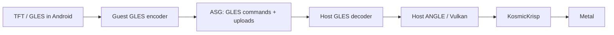

# Structural performance opportunities — 2026-09-06

September 8 update: the trace-led buffer-view cache now leads the queue.
See [overnight experiments and current evidence](performance-experiments-20260908.md).
The dated investigation below is retained as research context.

The strongest new finding is a working **host ANGLE → KosmicKrisp** hardware
path. It passes the tested compute, image, sync, and texture-buffer workloads
on M1 Max, where the same probe using the packaged MoltenVK aborts. It is not
complete GLES 3.2 and has not run TFT. This materially changes the feasibility
of moving GLES translation out of the VM.

The smaller settings investigations are in
[Additional performance candidates](performance-next-candidates.md).

## What a large win requires

Going from 35 to 57 FPS means reducing mean frame time from 28.57 to 17.54 ms,
saving about **11 ms per frame**. Recovering a 15 FPS fight to 30 FPS requires
saving **33.3 ms per frame**. These are frame-budget calculations, not forecasts.

The historical Trial profile points at serialized RHI submission, transport,
and downstream synchronization. Its 31.49% RHIThread and 16.44% transport
figures are shares of CPU samples; they are neither critical-path fractions nor
predictable FPS gains. A current late-PvP trace must establish milliseconds on
the frame's critical path before estimating an optimization's game-level gain.

## 1. Evaluate KosmicKrisp in the existing Android path

Current:

```text
TFT GLES → guest ANGLE → Vulkan gfxstream / ASG → host decoder → MoltenVK → Metal
```

Candidate:

```text
TFT GLES → guest ANGLE → Vulkan gfxstream / ASG → host decoder → KosmicKrisp → Metal 4
```

This changes the host driver while retaining the game and guest graphics
architecture. The opportunity is different command encoding, resource handling,
and synchronization cost; no protocol layer disappears in this variant.

The pinned Emulator SDK already contains a KosmicKrisp ICD and driver. The
local probe reports **KosmicKrisp-26.1.99**, Vulkan 1.3.348. Its reported version
does not establish that it contains the newer SDK's Vulkan 1.4/Metal 4 changes.
Compare this packaged driver first for compatibility, then separately evaluate
a pinned newer version if justified.

LunarG's July 28 SDK 1.4.357.0 announcement reports up to 2.35× performance
versus the preceding KosmicKrisp SDK, Metal 4 command encoding, and removal of
CPU overhead for ONE_TIME_SUBMIT command buffers. This is **not** a benchmark
against MoltenVK or TFT. It is a reason to test an alternate driver, not an
expected game multiplier. The retained guest ANGLE source uses ONE_TIME_SUBMIT
for at least one command-buffer path (`vk_renderer.cpp:1992`); this is a
mechanistic connection, not attribution of that path's frame cost.

First milestone: a separate emulator session that attests the actual selected
driver and passes Android graphics/composition, guest ANGLE, and a small draw
probe. Then compare matched combat. An environment variable alone is not proof
of selection: the inspected upstream emulator setup explicitly selects
MoltenVK for a macOS host-Vulkan configuration. Its code is upstream context,
not an exact-source attestation of the installed binary.

Sources: [July SDK changes](https://www.lunarg.com/lunarg-releases-vulkan-sdk-1-4-357-0/),
[KosmicKrisp requirements](https://docs.mesa3d.org/drivers/kosmickrisp.html),
[emulator graphics setup](https://android.googlesource.com/platform/external/qemu/+/refs/heads/emu-master-dev/android/android-ui/modules/aemu-gl-init/src/android/opengl/emugl_config.cpp).

## 2. Move ANGLE to the host and transport GLES



This removes guest ANGLE execution and Vulkan command serialization from the VM
path. It moves translation work to macOS; it does not eliminate that work.
The hypothesis is fewer or cheaper guest-host interactions and less serialized
guest driver work. GLES can also be chatty, so call counts, synchronous queries,
upload bytes, and critical-path time must be measured rather than inferred from
the shorter diagram.

**New local evidence:** four isolated host-probe invocations used identical
ANGLE/Vulkan-loader binaries and an explicitly selected ICD. Two KosmicKrisp
runs passed compute SSBO readback, image load/store, fence synchronization, and
texture-buffer readback. A strict run without version overrides rejected ES 3.2
creation but passed the supported ES 3.1 subset. The MoltenVK control terminated
with SIGABRT. The working production guest-ANGLE path was not exercised or
changed by this comparison.

Both override-enabled KosmicKrisp runs still failed geometry and tessellation
pipelines with zero limits. Their process exit was therefore **1**, correctly
rejecting a complete ES 3.2 claim. The successful tests used pbuffer surfaces,
not an Android game window. The
[four-run audit](../artifacts/host-angle-kosmickrisp-capability-screen-20260906.json)
records library hashes, selected driver, per-context results, and failures.

This avoids making an ES 3.1/3.2 implementation in **ANGLE's Metal backend** the
first prerequisite. ANGLE's documented Metal support remains ES 3.0; its Vulkan
backend is a separate implementation. The previously built gfxstream capability
prototype and guest/host compatibility work are still needed. Existing loader
aliases do not repair texture-target validation or missing functionality.

First milestone: carry the already passing host subset through a source-matched
guest GLES stack with real surfaces, uploads, barriers, and readbacks. Establish
the game's actually used feature set and implement or verify those operations;
never treat a raised version string or non-null function pointer as sufficient.
The current production guest ANGLE also reports zero geometry/tessellation
limits, so whole-API conformance is not evidence of what TFT actually exercises.
This observation narrows research; it does not certify an incomplete backend
for other games or future TFT patches.

Sources: [ANGLE backend support matrix](https://chromium.googlesource.com/angle/angle/+/main/README.md),
[previous guest/host findings](native-gles-transport-experiment.md).

## 3. Native iPad client: excluded after owner validation

On September 8 the owner confirmed this direction was already tested and is
blocked by signature / Device Attest and the MVN framework. It is excluded from
the eight-hour performance campaign. The earlier read-only bundle and local
code-signature checks did not establish runtime compatibility and do not reopen
this direction. No additional iPad experiments are planned.

## 4. Remove repeated per-draw uniform uploads and waits

This is the largest locally measured *subsystem* opportunity already in the
queue. The pooled map-once strategy reduced synthetic time per draw by about
49% at 512 draws/frame and 53% at 1024; the broader strategy record won eight
brackets across draw densities and ASG/pipe. It did not measure TFT FPS or prove
Unreal executes the same path. The largest measured pool was only 32 KiB, so
those results do not size the proposed 16 MiB Unreal pool.

First milestone: attest the current-release UBO pool candidate, preserve raw
call chains in real combat, and establish map/update/descriptor/submit counts
and milliseconds per frame. Test it separately from `r.RHICmdBypass=0`, then
test the combination only if the isolated results justify it. A source-level
driver change to coalesce uploads or eliminate synchronous round trips needs
evidence of the exact calls; blindly removing ASG notifications already failed.

For illustration only: halving a path that consumes 40% of frame time produces
1.25× FPS, while halving a 10% path produces only 1.053×. The microbenchmark's
roughly 2× throughput does not imply 2× game FPS.

Evidence: [density screen](../artifacts/android-gles-ubo-density-screen-20260815.json),
[transport cross-check](../artifacts/android-gles-ubo-transport-crosscheck-20260815.json),
[capacity audit](../artifacts/unreal-opengl-ubo-capacity-sizing-audit-20260815.json),
[frame-profile limits](../artifacts/simpleperf-stage1-8-transport-audit-20260815.json).

## Recommended order

For the Android product, screen the alternate host driver first: it is a much
smaller integration than moving ANGLE across the VM boundary. Use its result to
decide whether host-driver work merits investment. The GLES-transport
architecture is the larger controlled R&D option; per-draw UBO work is the
existing measured lead to keep active. Native iPad is excluded by the owner's
completed compatibility investigation.

None of these paths has a new TFT FPS result. No production runtime, preset,
library, or AVD was changed by this research.
